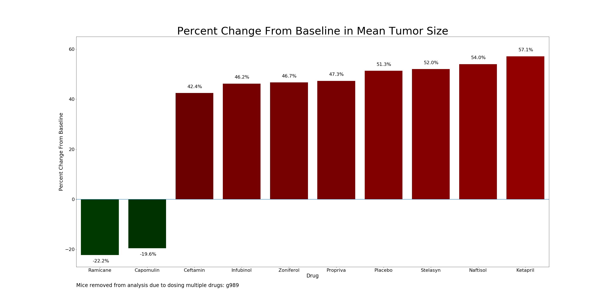

# 05-Matplotlib

UNC Data Analytics Boot Camp
Spring, 2019

## Option 2: Pymaceuticals Inc

### Observations

By all measures, two drugs were clearly more efficacious than the comparitors: Ramicane and Capomulin

#### Tumor Size

Only Ramicane and Capomulin were associated with decreased tumor size at 45 days post baseline.  While their effect sizes do not appear to be significantly different from one another, they were both clearly superior to all comparitor drugs.  The remaining drugs performed similarly to the placebo and were all associated with an increase in tumor size.

#### Metastatic Sites

No drug was able to completely stop the increase in metastatic sites at 45 days post baseline.  However, Ramicane and Capomulin performed the best with average increases of approximately 1.2 and 1.5 sites, respectively.  For comparison, the worst performing drug by this measure, Ketapril, was associated with a mean increase of approximately 3.4 metastatic sites at 45 days post baseline.

#### Survival

Mice dosed with Ramicane or Capomulin appear to have higher survival rates at 45 days than mice dosed with the comparitor treatments.  The 45-day survival rates for Ramicane and Capomulin were approximately 83% and 80%, whereas survival rate was approximately 50% in the same time frame for the other drugs.

#### Percent Change from Baseline in Mean Tumor Size

As noted above, only Ramicane and Capomulin were associated with a decrease in mean tumor size.  Ramicane was associated with a 22.2% decrease and Capomulin was associated with a 19.6% decrease.  For comparison, the best performing comparitor, Ceftamin, was associated with a 42.4% increase in mean tumor size.

### Programmatic issues
   * Could not identify satisfactory way to add footnotes (consistent location and spacing)
   * Ran out of time to sort legend consistently
   * Images are very large, but this is intentional to allow for zooming
   * I realized as a wrote this document that Percent Change from Baseline should have been derived on a per-mouse basis, then aggregated.  I have instead presented the percent change in the aggregate summary.
